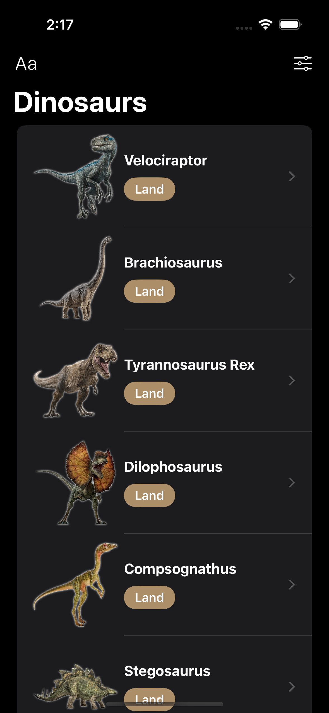
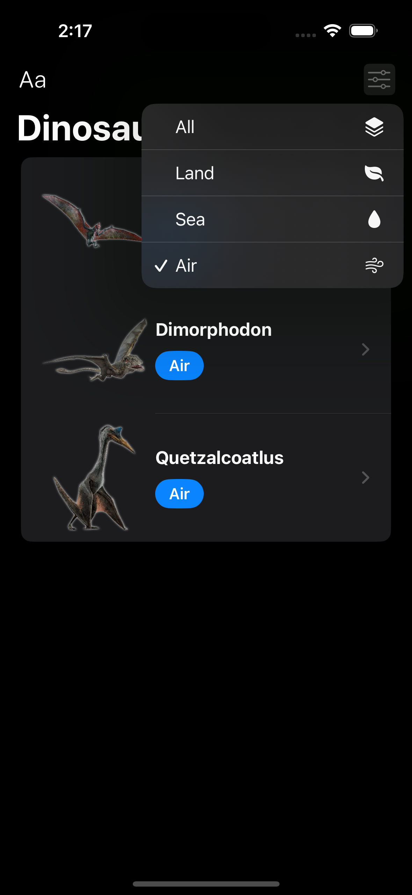
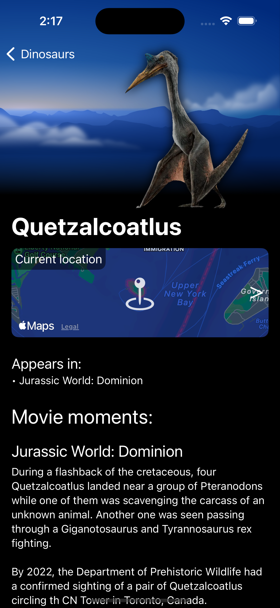
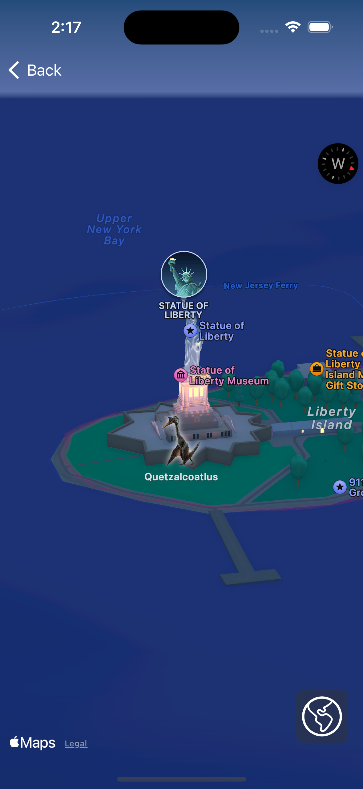
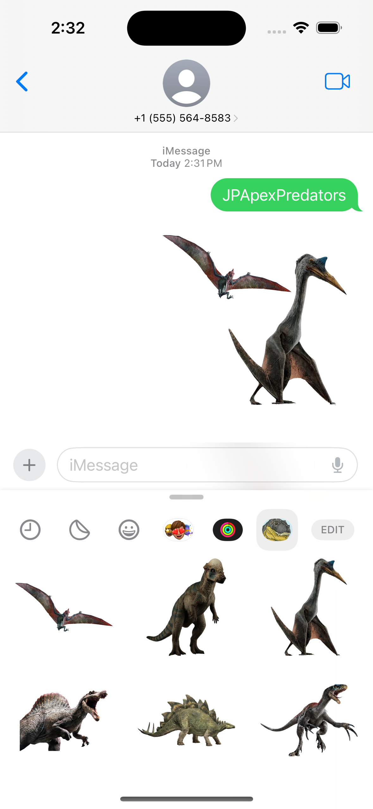

<div align="center">
  <h1>JPApexPredators</h1>

  <p>
    <a href="https://developer.apple.com/swift/" target="_blank"></a>
    <a href="https://developer.apple.com/xcode/"></a>
    <a href="https://developer.apple.com/ios/"></a>
  </p>

  <div>
    &nbsp;&nbsp;&nbsp;
    &nbsp;&nbsp;&nbsp;
    
    <br><br>
    &nbsp;&nbsp;&nbsp;
    &nbsp;&nbsp;&nbsp;
    
  </div>
</div>

## Overview
This SwiftUI project is a Jurassic Park themed application that showcases various dinosaurs from the Jurassic Park and Jurassic World movie franchises.

Based on the Udemy course [iOS 18, SwiftUI 6, & Swift 6: Build iOS Apps From Scratch](https://www.udemy.com/course/ios-15-app-development-with-swiftui-3-and-swift-5/).

### 💡 Custom Implementations
The following features and improvements were independently developed, extending beyond the course curriculum:

- Integration of additional [packages](#packages) to extend capabilities and streamline development
- [Project structure](#project-structure) for better organization
- MVVM architecture, including using `@StateObject` and `@ObservedObject`
- Reusable UI components for better maintainability

## Features
- Browse a list of dinosaurs from the Jurassic Park universe
- Filter dinosaurs by type (land, sea, air)
- Search for specific dinosaurs
- View detailed information about each dinosaur
- Interactive map showing dinosaur locations
- Sticker pack extension for iMessage

## Demo


## Project Structure
- `Views/`: Main views for the dinosaur list, detail, and map interfaces
- `ViewModels/`: View models implementing the application logic
- `Models/`: Data models for dinosaurs and related types
- `Services/`: Services for fetching dinosaur data
- `Resources/`: JSON data file containing dinosaur information

```
JPApexPredators/
├── JPApexPredatorsApp.swift
├── Views/
│   ├── DinosaurListView.swift
│   ├── DinosaurDetailView.swift
│   └── DinosaurMapView.swift
├── ViewModels/
│   ├── DinosaurListViewModel.swift
│   ├── DinosaurDetailViewModel.swift
│   └── DinosaurMapViewModel.swift
├── Models/
│   ├── Dinosaur.swift
│   └── DinosaurType.swift
├── Services/
│   └── DinosaurService.swift
└── Resources/
    └── dinosaurs.json
```

## Packages
This project uses Swift Package Manager (SPM) for dependency management. The following packages are included:

- [Inject](https://github.com/krzysztofzablocki/Inject) - Used for hot reloading during development
- [SwiftLint](https://github.com/realm/SwiftLint) - Used for code linting
- [SwiftFormat](https://github.com/nicklockwood/SwiftFormat) - Used for code formatting